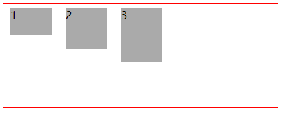
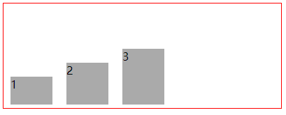
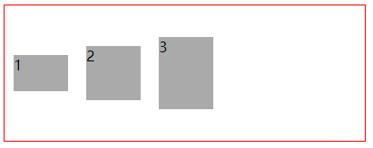
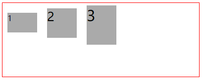
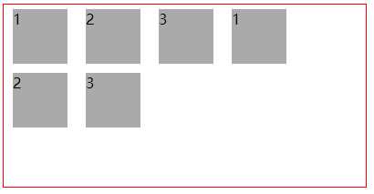
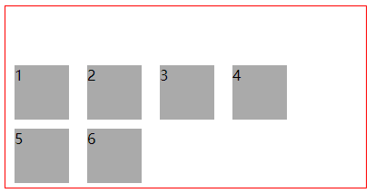
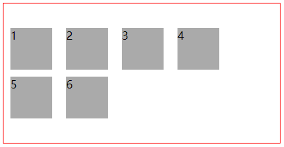
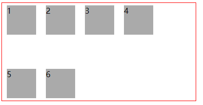
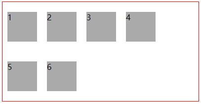
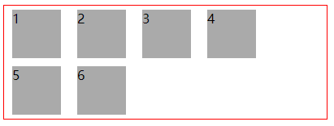

### flex布局
flex布局是Flexible Box 模型，通常被称为 flexbox，即 “弹性布局”。是一种一维的布局模型。
flexbox 一次只能处理一个维度上的元素布局，一行或者一列。

#### 定义
定义一个flex布局，使用display:flex,如果是一个行内flex布局为 display:inline-flex。
如：

```
<!--heml代码-->
 <div class="flex-demo1"></div>
 
 <!--css定义,使上面布局为flex布局-->
 <style>
    .flex-demo1{
        display:flex;
    }
 </style>
  
```
如果要使用行内flex布局，将 display:flex 变为 display:inline-flex即可;

【注】如果涉及到兼容性，一般需要做兼容处理

```
display: -webkit-box;   /* OLD - iOS 6-, Safari 3.1-6 */
display: -moz-box;  /* OLD - Firefox 19- H5不用考虑 */
display: -mz-flexbox; /* TWEENER IE 10 */
display: flex; /* NEW, Spec - Opera 12.1, Firefox 20+ */
```

#### flex布局容器的属性

1. flex-direction 属性
此属性决定主轴的方向，内部元素是横向排列还是纵向排列，有四个值 row 、 row-reverse 、 column 、 column-reverse;将flex-direction设置为row或row-reverse ，表示主轴方向显示，即水平方向排列，值为column或column-reverse，表示交叉轴，即垂直方向排列。

* flex-direction值为row,表示从左到右排列为一行。以下代码表示flex-demo1中的子元素为从左到右排列，如果子元素超过父元素的总宽，不会折行显示，只显示为一行。
如果要换行需要设置flex-wrap的属性。

html

```html
  <div class="flex-demo1">
    <span>1</span>
    <span>2</span>
    <span>3</span>
  </div>
```

css

```css
    .flex-demo1{
      display: flex;
      flex-direction: row;
      border: 1px solid #FF0000;
    }
    .flex-demo1 span{
      display: block;
      width: 60px;
      height: 60px;
      background-color: #aaaaaa;
      margin: 5px 10px;
    }
```
显示效果


* flex-direction值为 row-reverse ：主轴为水平方向，起点在右端


* flex-direction值为 column ：主轴为垂直方向，起点在上方


* flex-direction值为 column-reverse ：主轴为垂直方向，起点在下方


2. flex-wrap属性，有三个值可选 nowrap、wrap、wrap-reverse; nowrap表示不换行，wrap表示第一行在上面，wrap-reverse表示第一行在下面。

* flex-wrap值为 nowrap 不换行


* flex-wrap值为 wrap，第一行在上面


* flex-wrap值为 wrap-reverse ，第一行在下面


【注】：当flex-direction值为column或column-reverse时，此属性不能显示出效果，如果没有设置flex-direction，默认为水平排列，此属性有效果。

3. flex-flow属性是flex-direction和flex-wrap的简写，默认值为 row nowrap ，赋值时先写flex-direction的值，再写flex-wrap的值。

```
flex-flow: row wrap;
```

4. justify-content属性，表示在水平方向的对齐方式。
>1. flex-start（默认值）：左对齐


>2. flex-end：右对齐


>3. center： 居中


>4. space-between：两端对齐，项目之间的间隔都相等。


>5. space-around：每个项目盒子的间隔相等。


5. align-items属性,表示设置交叉轴上的对齐方式，垂直方向对齐方式

>1. flex-start：交叉轴的起点对齐。



>2. flex-end：交叉轴的终点对齐。



>3. center：交叉轴的中点对齐。



>4. baseline: 项目的第一行文字的基线对齐。



>5. stretch（默认值）：如果项目未设置高度或设为auto，将占满整个容器的高度。


6. align-content属性定义了多根轴线的对齐方式。如果项目只有一根轴线，该属性不起作用,将设置 flex-wrap: wrap;

>1. flex-start：与交叉轴的起点对齐(从上到下依次排列)。



>2. flex-end：与交叉轴的终点对齐(最下方开始排列)。



>3. center：与交叉轴的中点对齐。



>4. space-between：与交叉轴两端对齐，轴线之间的间隔平均分布。



>5. space-around：每根轴线两侧的间隔都相等。所以，轴线之间的间隔比轴线与边框的间隔大一倍。



>6. stretch（默认值）：轴线占满整个交叉轴。将box高设置为auto


