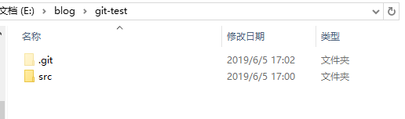
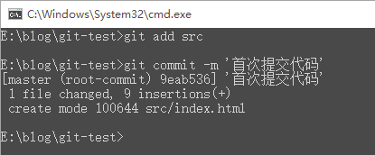
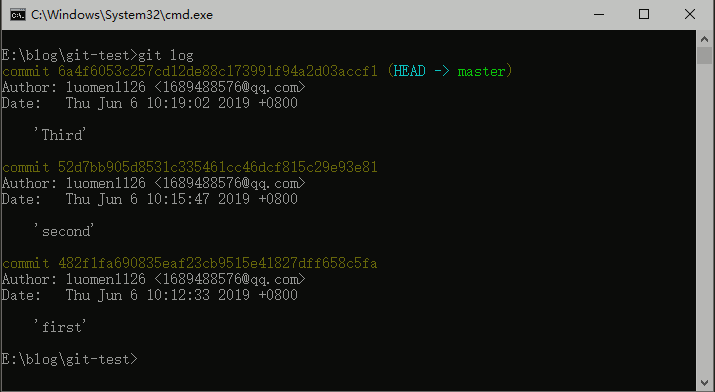
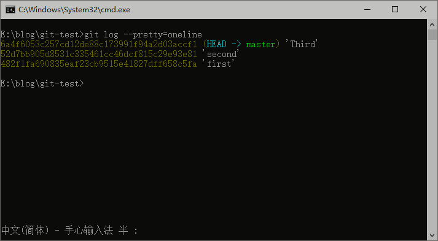
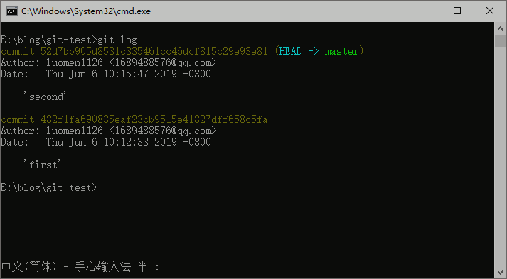
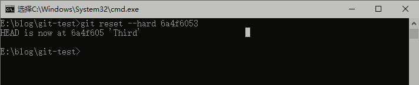
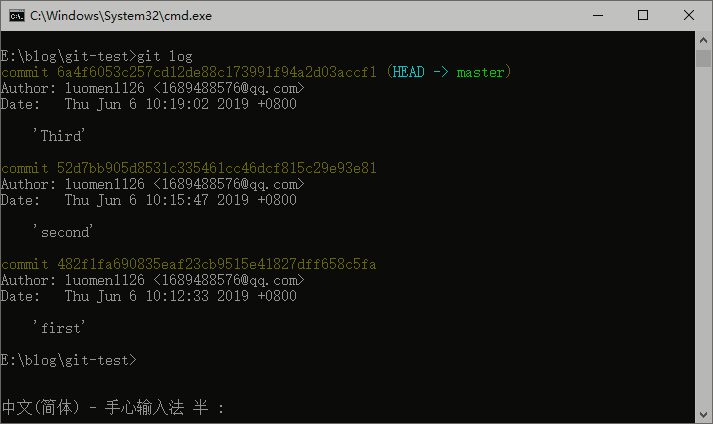
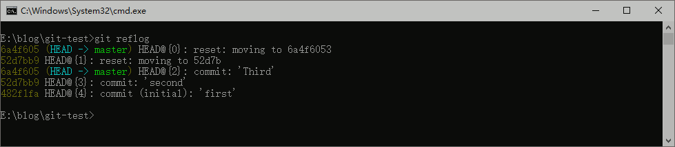

### 1. git 的简单使用

#### windows系统上安装git

1. 在windows上面直接从[官网](https://git-scm.com/downloads)上面下载程序安装即可。
2. 安装完成后在开始菜单栏找到“Git”->“Git Bash” 跳出一个命令窗口，输入以下命令进行配置。
```
$ git config --global user.name "Your Name"

$ git config --global user.email "email@example.com"
```
3. 查看用户名和邮箱

```
$ git config user.name

$ git config user.email
```

4. 修改用户名和邮箱
```
$ git config --global user.name "username"

$ git config --global user.email "email"
```
#### 2. 创建版本库

1. 首先创建一个空文件，如: git-test [注：目录中不能包含中文] ，在空文件夹下调试出命令窗口，使用以下命令初始化git.

```
git init
```
输入git init 后空文件夹下面会出现一个.git的文件。【注：.git文件不能手动更改，否则把仓库改乱了会出现不可意料的情况】

2. 在git-test文件下创建一个src文件夹，src文件下创建一个index.html文件，目录我文件如图：



3. 把一个文件放到git仓库，需要执行两步：
* 第一步：在命令行中输入git add src/ 表示把src文件夹和src下的所有内容添加到仓库，执行命令后，没有任何显示，说明添加成功。
* 第二步：执行 git commit 命令，表示把文件提交到仓库中



#### 3.版本回退

1. 版本回退
* 第一次提交的index.html文件内容是
```html
<!DOCTYPE html>
<html>
<head>
	<title>git学习</title>
</head>
<body>
	<h1>git学习</h1>
</body>
</html>
```

执行以下命令提交代码
```
git add src/
git commit -m'first'
```

* 第二次提交的index.html文件内容是,修改内容
```html
<!DOCTYPE html>
<html>
<head>
	<title>git学习</title>
</head>
<body>
	<h1>git学习</h1>
	<h2>初始化git项目</h2>
</body>
</html>
```
再次执行以下命令提交代码
```
git add src/
git commit -m'second'
```

* 第三次提交的内容再添加一行代码
```html
<!DOCTYPE html>
<html>
<head>
	<title>git学习</title>
</head>
<body>
	<h1>git学习</h1>
	<h2>初始化git项目</h2>
	<h3>提交文件</h3>
</body>
</html>
```
每次提交代码都需要执行
```
git add src/
git commit -m'Third'
```

* 以上提交那么多次文件后，我们需要知道一下提交的历史记录，查看我们所提交过的内容，使用 git log可以查看



使用git log --pretty=oneline 可以简化输入的历史信息



其中 ‘6a4f6053c257cd12de88c173991f94a2d03accf1’ 表示提交的id,即版本号

* 假如我们现在想要回到上一个版本，现在的版本出现了一点点小问题，可以使用 git reset --hard HEAD^ 命令回到上一个版本，其中HEAD表示当前版本。要回到上上一个版本就是使用 HEAD^^，再上一个就加一个'^',但是要回到50版本以前，就不好数，所以使用HEAD~50。也可以使用版本号返回到想回去的版本中。
```
git reset --hard HEAD 52d7b 
```

上面命令表示回到版本为‘52d7bb905d8531c335461cc46dcf815c29e93e81’ 的时候，可以不用全部输入，输入部分即可。再次输入 git log 后，显示为：



再次查看index.html的内容后为：
```html
<!DOCTYPE html>
<html>
<head>
	<title>git学习</title>
</head>
<body>
	<h1>git学习</h1>
	<h2>初始化git项目</h2>
</body>
</html>
```

看到上面内容确实是回到上一个版本了，如果要返回到第三个版本，就是刚刚回退之前的版本，只要命令窗口没有关闭，没有清除内容，可以找到版本号，使用git reset --hard 6a4f6053c257cd12de88c173991f94a2d03accf1



此时可以看到文件又回到了第三次提交的版本



如果没有记录下版本命令时，或把命令窗口关掉时可以使用 git reflog 命令来查看每一次命令的记录


